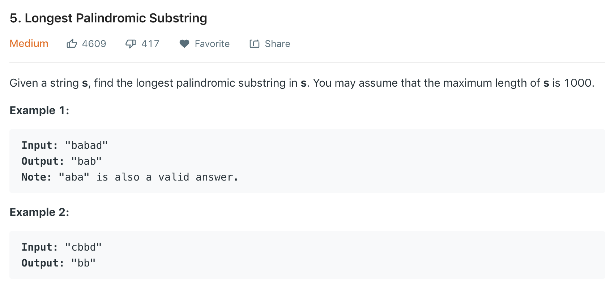
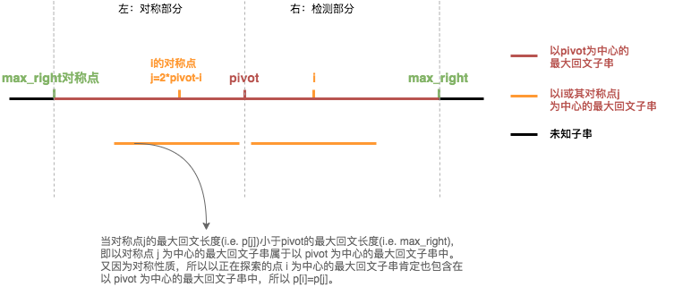
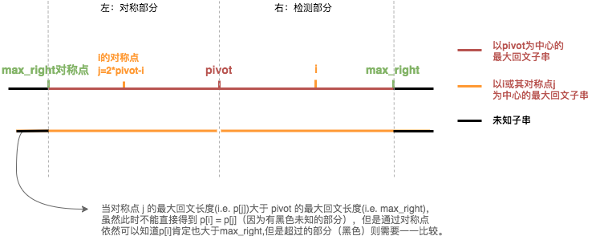

首先，**回文指的是正序倒序都相同的字符序列**。在此我们尝试用三种方法解决此题：DP，ExpandAroundCenter和Manacher。

---

# DP

DP是解决此题的一种常规思路。根据回文的定义可知，一个字符串$$S_{ij}$$是回文的条件为：
$$
S_{ij} = \begin{cases} 
true & = & (\text{substring} \ S_{i+1, j-1} \ \text{is palindrome}) \ \ \&\& \ \ (S_i == S_j)\\
false & = & \text{otherwise}
\end{cases}
$$

可以看出这是一个bool类型的状态转移矩阵。例如，如果`bab`是回文子串，那么`ababa` 肯定也是回文子串，因为 $$S_1==a==S_5$$​ 且`bab`是回文子串。为了记录子串是否为回文，我们利用一个数组`dp[n][n]`来记录子串是否会回文。**整个DP寻找思路可以看成先把子串长度为1或2的初始回文子串找到，然后从子串长度为3开始利用状态转移方程寻找**。时间复杂度和空间复杂度均为$$O(N^2)$$，代码如下：


```c
char* longestPalindrome(char* s) {
    int max_count = 1, len = strlen(s), start = 0;
    if(len < 2)
        return s;
    int dp[len][len]; //记录子串是否为回文
    memset(dp, 0, sizeof(dp));
    
    //先初始化dp,单个字符和一对相等的字符都是回文。相当于先把子串长度为1和2的回文找到。
    for(int i=0; i<len; i++)
    {
        dp[i][i] = 1;
        if(s[i+1] && s[i] == s[i+1])
        {
            dp[i][i+1] = 1;
            max_count = 2;
            start = i;
        }
    }
    
    //从长度为3的子串开始寻找
    for(int sublen=3; sublen<=len; sublen++)
        for(int i=0; i<=len-sublen; i++)
        {
            int j = i+sublen-1;
            if(dp[i+1][j-1] && s[i] == s[j])
            {
                dp[i][j] = 1;
                if(max_count < sublen)
                {
                    max_count = sublen;
                    start = i;
                }
            }
        }
    char *res = (char *)malloc(max_count+1);
    memcpy(res, s+start, max_count);
    res[max_count] = 0;
    return res;
}
               
```

---

# ExpandAroundCenter

实际上，我们并不需要用一个辅助数组`dp[n][n]`来记录子串是否为回文，而是可以从最短的子串开始寻找。其核心思想是**找到一个回文子串的中心点，然后不断向两边扩展直到两边字符不相同**。需要注意的是该中心点可能是一个字符，也可能是两个字符，例如`aba `的中心点是`a`, `abba` 的中心点则是`bb`。如此则把空间复杂度降为 $$O(N)$$。代码如下：


```c
void expandAroundCenter(char *s, int left, int right, int len, int *start, int *max_count)
{
    while(left>=0 && right<=len && s[left] == s[right])
    {
        left--;
        right++;
    }
    if(*max_count < right-left-1)
    {
        *max_count = right-left-1;
        *start = left+1;
    }
}


char* longestPalindrome(char* s) {
    int len = strlen(s), start = 0, max_count =0;
    if(len < 2)
        return s;


    for(int i=0; i<len; i++)
    {
        expandAroundCenter(s, i, i, len, &start, &max_count);
        expandAroundCenter(s, i, i+1, len, &start, &max_count);
    }
    
    char *res = (char *)malloc(max_count+1);
    memcpy(res, s+start, max_count);
    res[max_count] = 0;
    return res;
}
               
```

---

‌

# Manacher's Algorithm

Manacher算法实际上可以看做是ExpandAroundCenter和DP方法的结合与优化：它基于ExpandAroundCenter的思想，先找到每个回文子串的中心点；同时利用DP的思想，**借助当前判断的子串的对称串（肯定被搜索过）来判断当前子串是否为回文子串**。不需要额外的数据结构来利用对称子串的信息是Manacher算法的关键，其中可以分为如下两种情况：







在整个循环中，我们需要不断更新两个变量：

- `pivot` ：当前检测到的最大的回文子串的中心点。
- `max_right` ：当前检测到的最大的回文子串的右边界点。

这样的话，便能够保证`pivot`是当前已知的最长回文子串的中心点，`max_right`则是其右边界位置。这样，我们就可以利用这个当前已知的最长回文串来判断当前检测点`i`的回文子串信息，具体的思路为：

1. 利用当前检测点`i`的对称点`j`(`j`= 2 *`i`- 1）来判断`i`的回文信息。因此此时`j`的回文信息是已知的，我们已经先检测过`j`的回文信息了。
2. 此时又分为上图的两种情况：
   * 当以对称点`j`为中心的最大回文子串（i.e. `p[j]`）小于以`pivot`为中心的最大回文子串长度（i.e. `max_right`的对称点的位置），则说明以当前检测点`i`为中心的最大回文子串长度（i.e. `p[i]`）也小于`max_right`。则可以推出`p[i]=p[j]`（因为以`i`和`j`为中心的最大回文子串都包含在了以`pivot`为中心的最大回文子串当中）。
   * 当以对称点`j`为中心的最大回文子串（i.e. `p[j]`）大于以`pivot`为中心的最大回文子串长度（i.e. `max_right`的对称点的位置），此时则不能根据对称点`j`的信息直接得到`i`的最大回文子串的情况，因为对称点`j`表示了以`j`为中心的最大回文子串超过了以`pivot`为中心的最大回文子串的长度（i.e. `p[j] > max_right`），所以对于超过部分的字符（即图2中的黑色部分）是否还是回文无法判断，只能按照老办法一个一个比较。但是，我们还是可以根据对称点`j`知道至少`i`到`max_right`这段子串是回文子串（因为`j`到`max_right`的对称点是回文子串），所以可以得到`p[i] >= max_right`。因此，我们依然可以直接让`p[i]=max_right`然后从`mar_right`的位置处开始按照老办法比较来减少运算次数。
3. 最终，Manacher算法实现了一次遍历便能够找到最长回文子串。该方法的具体步骤可以参考[here](https://www.felix021.com/blog/read.php?2040)。

实现代码如下：

```c
#define MIN(a,b) ((a)<(b)?(a):(b))

//预处理字符串,将s="babad" -> "$#b#a#b#a#d"，将所有的输入都变为奇数：奇数+偶数=奇数
void preprocess(char *s, char *ss, int len)
{
    ss[0] = '$';
    ss[len-1] = 0;
    for(int i=1, j=0; i<len; i++)
    {
        if(i&1) ss[i] = '#';
        else 
        {
            ss[i] = s[j];
            j++;
        }
    }
}

char* longestPalindrome(char* s) {
    int l = strlen(s);
    if(l<2)
        return s;
    int len = l*2+3;
    char ss[len];
    preprocess(s, ss, len);

    int p[len*2], pivot = 0, max_right = 0;
    memset(p, 0, sizeof(p));
  	//计算p[n]:以每个字符为中心的最长回文子串长度
    for(int i=1; i<len-2; i++)
    {
        //i不在max_right里面时先将p[i]置为1
        p[i] = (i<max_right) ? MIN(p[2*pivot-1], max_right-i) : 1;
        while(ss[i+p[i]] == ss[i-p[i]]) p[i]++;
        if(max_right < i+p[i])
        {
            max_right = i+p[i];
            pivot = i;
        }
    }
  	//根据p[i]取出相应结果
    int max_count = p[0];
    int max_idx = 0;
    for(int i=1; i<len-2; i++)
    {
        if(max_count < p[i])
        {
            max_count = p[i];
            max_idx = i;
        }
    }
    char *res = (char *)malloc(max_count+1);
    for(int i=max_idx-max_count+1, j=0; i<max_idx+max_count; i++)
    {
        if(ss[i] != '#')
        {
            res[j] = ss[i];
            j++;
        }
    }
    res[max_count-1] = 0;
    return res;
}

```

<link rel="stylesheet" href="https://cdn.jsdelivr.net/npm/gitalk@1/dist/gitalk.css">
<script src="https://cdn.jsdelivr.net/npm/gitalk@1/dist/gitalk.min.js"></script>
<div id="gitalk-container"></div>
var gitalk = new Gitalk({
  clientID: 'GitHub Application Client ID',
  clientSecret: 'GitHub Application Client Secret',
  repo: 'GitHub repo',
  owner: 'GitHub repo owner',
  admin: ['GitHub repo owner and collaborators, only these guys can initialize github issues'],
  id: location.pathname,      // Ensure uniqueness and length less than 50
  distractionFreeMode: false  // Facebook-like distraction free mode
})

gitalk.render('gitalk-container')


 


 


 


 